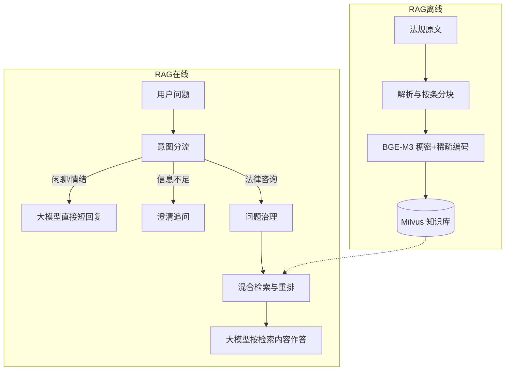
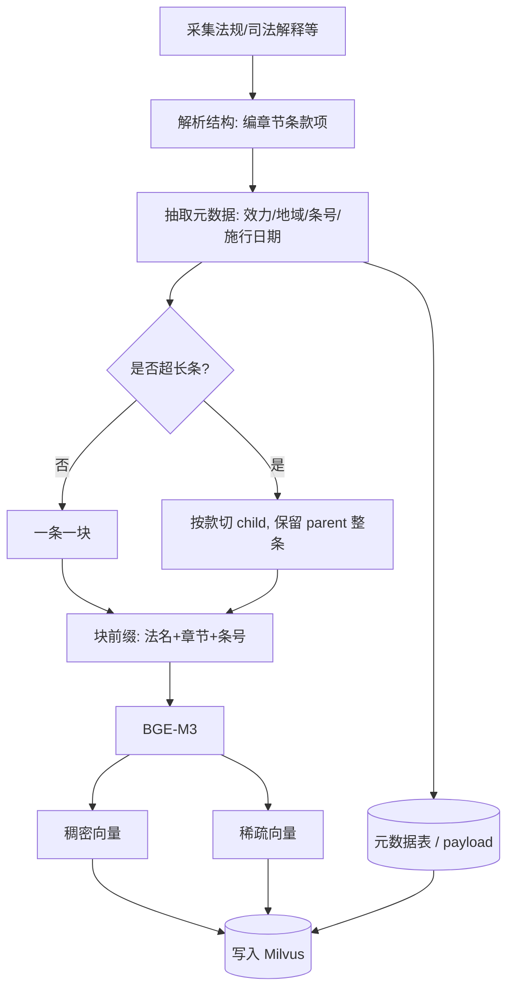
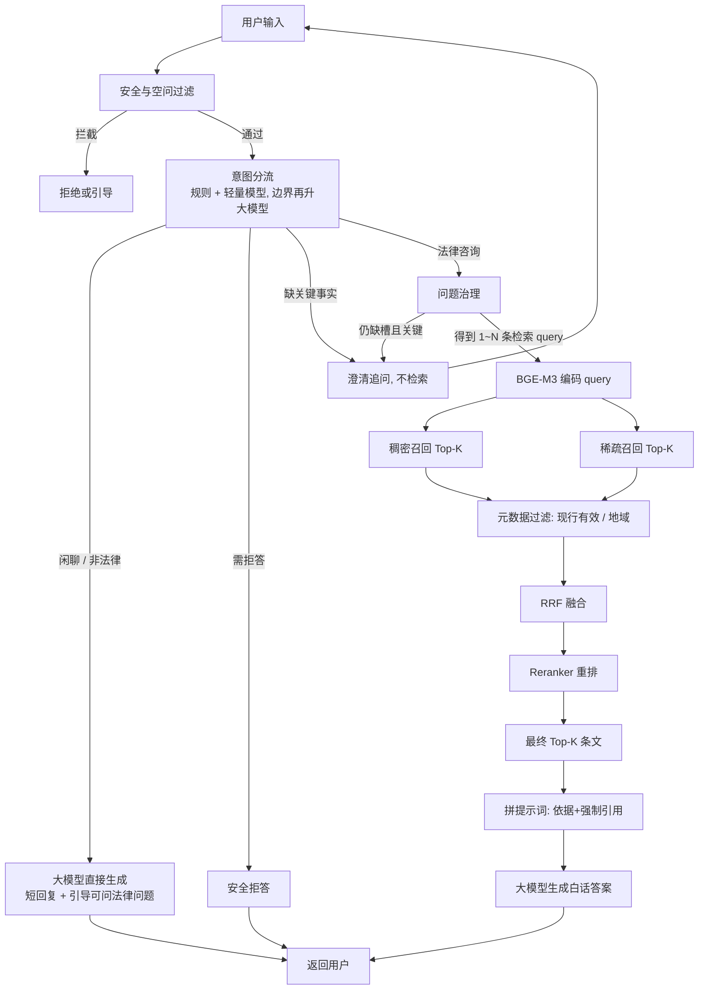
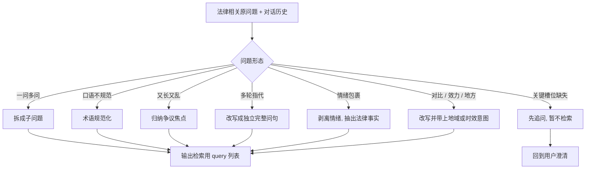
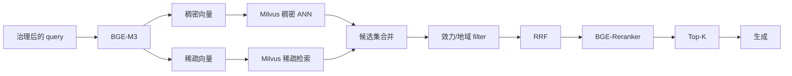

# 法律法规问答助手：流程图

当前范围：**砍掉高频问答**，只保留 RAG 离线建库 + RAG 在线检索生成。用户问题经意图分流后，法律咨询一律走混合检索，不再走 MySQL/BM25 直出答案。

---

## 1. 系统两模块关系

---

## 2. 离线建库流程

---

## 3. 在线主流程（无 FAQ）

---

## 4. 问题治理（进入检索前）

---

## 5. 检索子流程（双路召回）

